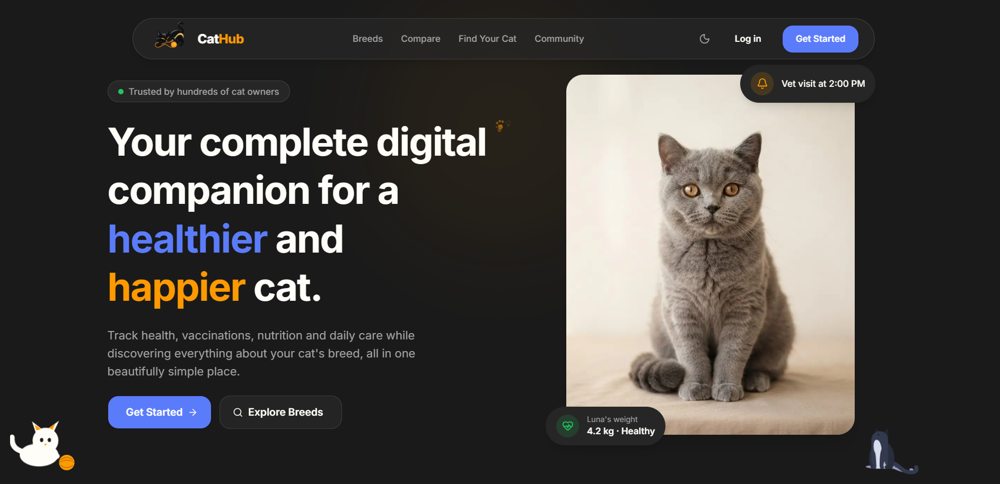
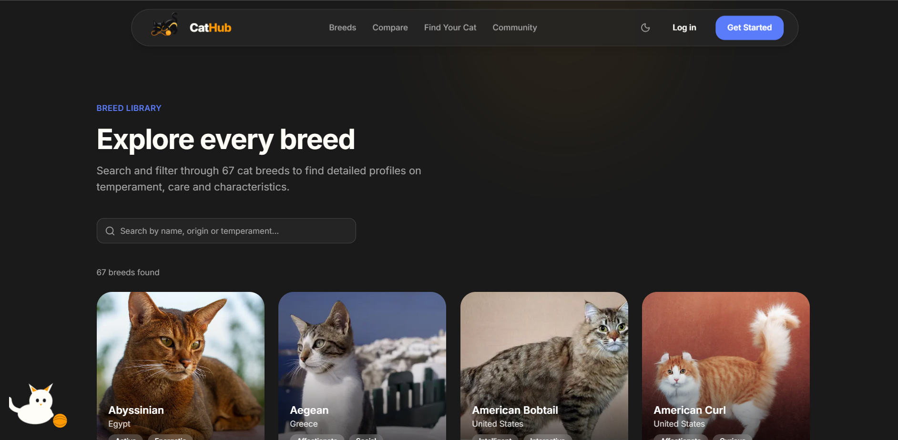
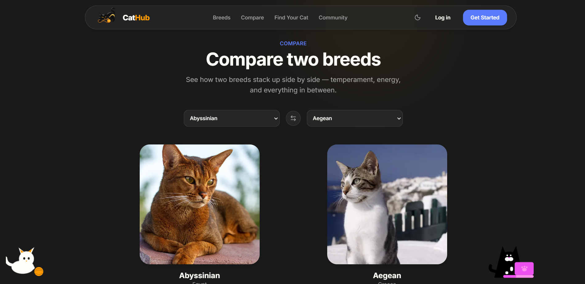

# CatHub

CatHub is a full-stack digital companion platform for cat owners, a place to track health records, vaccinations, breed information and daily care, all in one beautifully designed app.

## Live Demo

https://cat-hub-psi.vercel.app

## Features

- User registration and authentication (email confirmation, password reset)
- Add, edit and delete cat profiles with photo upload
- Medical timeline: vaccinations, deworming, vet visits, treatments and surgeries
- Automatic health status detection based on due dates and breed weight ranges
- Smart calendar with birthdays and upcoming medical reminders
- Breed Explorer with 60+ real breeds (search, filter, detailed profiles)
- Breed Comparison tool with side-by-side stats
- "Find Your Cat" quiz: breed recommendation based on lifestyle answers
- Community page: share public cat profiles with other users
- Contact form with real email delivery
- Dark mode with smooth theme transitions
- Fully responsive, with custom animations, micro-interactions and a floating magnetic navbar

## Security Features

- Row Level Security (RLS) policies on every database table
- Server-side-only API keys (never exposed to the browser)
- Protected routes via Next.js middleware, backed by database-level access control
- Honeypot spam protection on public forms
- Scoped Supabase Storage policies (users can only write to their own folder)

## Technologies

### Frontend
- Next.js 16 (App Router, Server Components)
- TypeScript
- Tailwind CSS 4
- shadcn/ui (Base UI)

### Backend
- Supabase (PostgreSQL, Authentication, Storage)
- Next.js Route Handlers (API routes)

### External Services
- TheCatAPI - real breed data and images
- Resend - transactional email delivery
- Vercel - hosting and deployment

## Database

Main tables:
- `cats` - pet profiles (owner, breed, weight, health status, public/private visibility)
- `medical_records` - vaccinations, treatments, vet visits, linked to each cat
- `profiles` - public-facing user info (name, avatar) for the Community page
- `contact_messages` - messages submitted through the contact form

All tables are protected with Row Level Security, ensuring users can only access their own data (or explicitly public cat profiles).

## Project Purpose

CatHub was built as a personal portfolio project to demonstrate full-stack development skills: authentication, a real relational database with RLS, third-party API integration, file storage, transactional email, and a polished, production-quality UI/UX from the ground up.

## Author

Liviu Spînu

LinkedIn: https://www.linkedin.com/in/liviu005/

# Screenshots

## Homepage

## Explore breeds

## Compare breeds

